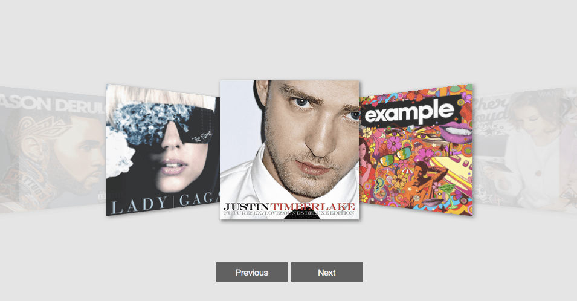

React Coverflow
===



## Installation

```
$ npm install react-coverflow
```

## Usage


## Contributors
* [andyyou](https://github.com/andyyou)
* [Calvert Yang](https://github.com/CalvertYang)

## Release History
* 2015-10-22 v0.1.0

## Development
```
# Compile component to dist/
$ npm run build

# Build source of site
$ npm run build-site

# Clean
$ npm run clean

# Development Server
$ npm run dev
```

## Todo

* 打包 npm 並測試
* 撰寫 Readme
* 發佈 gh-page
* 寫完簡易測試
* TravelCI yml 設定
* Touch event 
